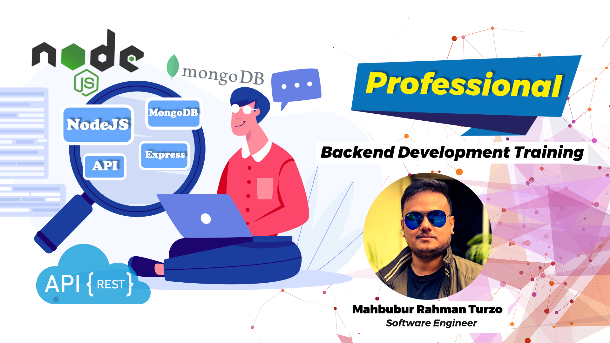

# NodeJS Professional REST API Backend Training with MongoDB বাংলা ভাষায়!

Instructed By : [Mahbubur Rahman Turzo](https://github.com/Turzoxpress)

## Instructed By : [Youtube Video Tutorial Playlist](https://www.youtube.com/watch?v=9gMoukN81Ow&list=PLp6lX102mPy4A7ajKYu0oxMr9zpdVepvy)

## Tools/Frameworks/Software/Technologies used till now:

- NodeJS
- Express
- MongoDB
- Mongoose
- Multer
- Postman
- Visual Studio
- JWT Token
- bycryptJS for encryption
- Robo 3T
- Ubuntu 20
- Google Cloud Server
- Apache & Apache Reverse Proxy
- Load Balancing

## Do you want to be a Backend Software Engineer? Then its the best free Bengali tutorial for you which is totally free!

## [Let's start to watch free youtube video tutorials](https://www.youtube.com/watch?v=9gMoukN81Ow&list=PLp6lX102mPy4A7ajKYu0oxMr9zpdVepvy)

## Contributing

Pull requests are welcome. For major changes, please open an issue first to discuss what you would like to change.

## License

[MIT](https://choosealicense.com/licenses/mit/)
